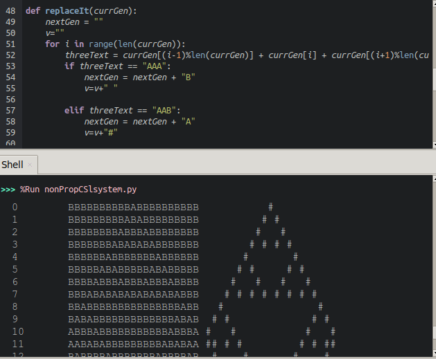

# L-systems
L-systems in p5.js and processing3 

[live: if else sentence expansion](https://editor.p5js.org/greggelong/full/JCBNfEyMW)

[live on github](https://greggelong.github.io/L-systems/L-system-if-else/index.html)

[live: switch statement sentence expansion, branching](https://editor.p5js.org/greggelong/full/BOO0xB5yp)

[live on github](https://greggelong.github.io/L-systems/L-system-swich-branching/index.html)

[live: switch statement sentence expansion, dragon](https://editor.p5js.org/greggelong/full/KbinrqOT-)

[live on github](https://greggelong.github.io/L-systems/L-system-swich-dragon/index.html)

[live: switch statement sentence expansion, random rules](https://editor.p5js.org/greggelong/full/1JsOaNZm6)

[live on github](https://greggelong.github.io/L-systems/L-system-switch-random-rules/index.html)

Revisiting L-Systems. Previously I have used #danielshiffman #thecodingtrain and #natureofcode algorithms. But this version uses a different sentence expansion algorithm.

 The L-System rule is just in a simple if else clause, or switch statement.
 
 If sentences contains an "F" (non terminal) make the substitution "FF+[+F-F-F]-[-F+F+F]".
 
 If sentence contains a terminal character +-[] then just append it
 
 I think this makes the substitution more explicit and easier to understand.
 More complex rules can be captured in a switch statement.

   I have refactored the turtle to use a switch statement
   I have added a generation count so it will reset before it breaks the browser

Another benefit of this if else or switch() sentence expansion algorithm is that you can use it directly in Processing3. Black and white pictures.
Processing3 doesn't have the object literal (comma separated name-value pairs in curly braces).
So you can end up making a class to encapsulate that data.  And the code gets you farther away from the simple substitution. #creativecoding #lsystem

There is also an L-system in Python. It is drawn with Turtle and is very slow.  I also needed to create a stack to push and pop the turtles heading and location as python turtle does not have a push() and pop() like processing and P5.js

[see python code live](https://trinket.io/python/8e480b5fb0)

-------------

## non propagative context sensitive L-systems

[live here](https://editor.p5js.org/greggelong/full/klTIfDXfB)

## non propagative L-system:
     meaning it replaces characters 1 for 1, so the sentence does not grow
  
## context sensitive:
     meaning it makes replacements by looking at neighbors as well as the char itself
     
     This happens to encode a one dimensional Wolfram cellular automaton
     the rule here is Wolfram 90
    
    There is an edge problem in these kind of cellular automata when you are looking at the neighbors
     of the first and last index 
    
     I am using modulo to solve the problem in python
    >>>(19+1)%20
    0
    
    the last index of a string of 20 chars is 19 so using modulo you can get 0
    
    >>>(0-1)%20
    19
    the first index of a sting of 20 chars - 1 will then = the last
    
    !!! but beware the JavaScript modulo bug !!!!!!
    !!!                                         !!!!
    
    >>(19+1)%20
     0

    >>(0-1)%20

     -1
     
     gives a negative result
     
     so here is the fix for javaScript negitive modulo
     from https://medium.com/@thomaspoignant/how-to-get-always-a-positive-modulo-remainder-9ac965361ff4
     
     ((((i-1)%20)+20)%20)  /// yikes!!!!
     
     where you have a string of 20 chars and yikes!!!
    
    you cannot just do this, which gives the correct result for 0-1:
    (0-1)%20+20
    (i-1)%20+20
    because all the other values will be wrong. you you have to do it the long way
    
 

L-Systems are a grammar. See my other code on [Context Free Grammar](https://greggelong.github.io/context-free-grammar/)

[home](https://greggelong.github.io)

